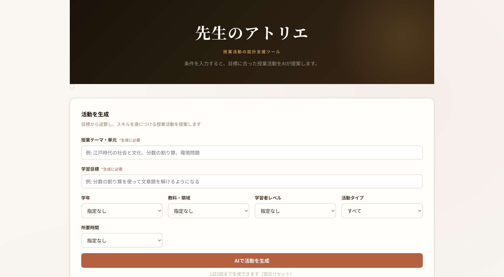

# 先生のアトリエ

**授業活動の設計を、AIが支援するWebツール**

学習目標と条件を入力するだけで、AIが最適な授業活動（ハンズオン・ケーススタディ・ロールプレイ等）を提案します。教師・研修担当者向けの無料ツールです。

**[デモを見る → https://sensei-no-atorie.vercel.app](https://sensei-no-atorie.vercel.app)**



---

## 作った背景

高校教員として授業設計に関わる中で、「どんな活動にすれば学習目標に届くか」を考える時間が膨大にかかることに課題を感じていました。

研究や事例収集に時間をかけなくても、目標から逆算して活動を設計できる仕組みがあれば、教師が子どもと向き合う時間を増やせると考え、このツールを作りました。

---

## 機能

- 授業テーマ・学習目標を入力するだけでAIが活動を提案
- 学年・教科・学習者レベル・活動タイプ・所要時間で条件を絞り込み
- 1日5回の生成制限（レート制限付きAPI）
- レスポンシブデザイン（モバイル対応）

---

## 技術スタック

| 分類 | 技術 |
|---|---|
| フロントエンド | HTML / CSS / Vanilla JavaScript |
| バックエンドAPI | Vercel Serverless Functions（Node.js） |
| AIモデル | Google Gemini 2.5 Flash API |
| レート制限 | Upstash Redis（Vercel KV） |
| ホスティング | Vercel |

---

## アーキテクチャ

```
ブラウザ（HTML/CSS/JS）
    ↓ POST /api/generate
Vercel Serverless Function
    ├── Upstash KV でレート制限チェック（IP + 日付ベース）
    └── Gemini API を呼び出して活動を生成
```

**設計上の判断：**
- サーバーレス構成により、常時起動サーバーの維持コストをゼロにした
- APIキーはサーバーサイドのみで保持し、フロントエンドに露出しない
- KVのキーを `ip:日付` とすることで、1日ごとに自動リセットされる仕組みを実現

---

## ローカル開発

### 前提

- Node.js 18以上
- Vercel CLI（`npm i -g vercel`）
- Gemini APIキー（[Google AI Studio](https://aistudio.google.com/) で取得）

### セットアップ

```bash
git clone https://github.com/YOUR_USERNAME/sensei-no-atorie.git
cd sensei-no-atorie
npm install
```

### 環境変数の設定

```bash
cp .env.example .env
# .env に GEMINI_API_KEY を記載
```

### 起動

```bash
vercel dev
# http://localhost:3000 でアクセス
```

---

## ディレクトリ構成

```
sensei-no-atorie/
├── index.html          # メインページ
├── style.css           # スタイル
├── script.js           # フロントエンドロジック
├── api/
│   └── generate.js     # Vercel Serverless Function（Gemini API呼び出し・レート制限）
├── data/
│   └── cases.json      # 授業事例データ（48事例）
└── docs/
    └── screenshot.png  # スクリーンショット
```

---

## 今後の展開

- [ ] 探求型モード（ゲーム・シミュレーション等の事例検索）の公開
- [ ] AI講座ビルダーとの統合（研修設計の自動化）
